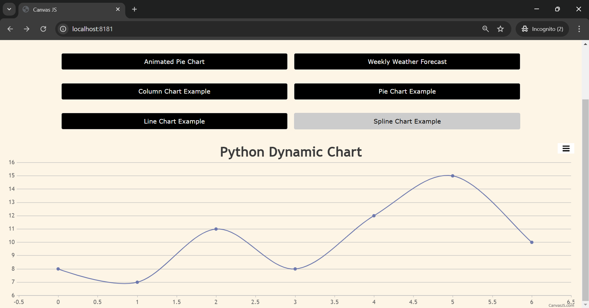

# CanvasJS Chart with Python/Flask

This project demonstrates how to create dynamic charts using CanvasJS with a Python/Flask backend.

---
## Prerequisites

- Python 3.x
- Flask
- pip

## Installation

1. Clone the repository:
    ```sh
    git clone https://github.com/jeetendra29gupta/canvasjs-flask-chart.git
    cd canvasjs-flask-chart
    ```

2. Create a virtual environment and activate it:
    ```sh
    python -m venv venv
    source venv/bin/activate  # On Windows use `venv\Scripts\activate`
    ```

3. Install the required packages:
    ```sh
    pip install -r requirements.txt
    ```

## Running the Application

1. Start the Flask server:
    ```sh
    python main_canvasjs_app.py
    ```

2. Open your web browser and navigate to `http://localhost:8181`.

## Usage

- Click on the buttons to render different types of charts.
- The charts will fetch data from the respective endpoints and render dynamically.

## Screenshots




---